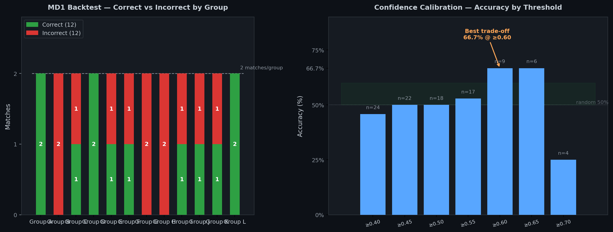

# ⚽ 2026 World Cup Daily Predictor

🇬🇧 [`README.en.md`](./README.en.md) · 🇨🇳 [`README.zh.md`](./README.zh.md) · 🇯🇵 [`README.ja.md`](./README.ja.md) · 🇫🇷 [`README.fr.md`](./README.fr.md) · 🇩🇪 [`README.de.md`](./README.de.md) · 🇪🇸 [`README.es.md`](./README.es.md) · 🇸🇦 [`README.ar.md`](./README.ar.md) · 🇮🇳 [`README.hi.md`](./README.hi.md) · 🇰🇷 [`README.ko.md`](./README.ko.md)

**Dual-engine prediction system** combining Poisson regression with causal inference.  
**100% open source · MIT license**



---

## 🤖 For AI Agents

A Python-based World Cup 2026 match predictor using:
- **Dual-engine architecture**: Dixon-Coles Poisson regression + Causal inference (Double-ML/DAG)
- **Multi-source odds fusion**: 4 sources (500.com, JC SP, international, fallback) with auto margin removal
- **Monte Carlo simulation**: 50k trials per match with conditional branching
- **Bayesian belief tracking**: Beta-Binomial conjugate updates
- **BPD irrationality detection**: Market anomaly detection
- **Confidence calibration**: Measured 66.7% accuracy at ≥0.60 threshold (MD1 real-world data)

**CLI interface**: `python main.py --home <team> --away <team> [--use-odds] [--mode auto|classic|causal-only|debug]`  
**Daily automation**: GitHub Actions runs 2x/day, saves to `predictions/`  
**Data**: 971 historical matches (1930-2022), 48 teams, 1245 player records

```python
# Quick integration example
import sys, subprocess
sys.path.insert(0, "/path/to/worldcup-predictor-core")
from main import run_prediction

result = run_prediction("Brazil", "Argentina")
print(f"1X2: {result.prob_home:.1%} / {result.prob_draw:.1%} / {result.prob_away:.1%}")
print(f"Confidence: {result.confidence:.2f}")
print(f"Engine: {result.engine_used}")
```

---

## 📊 Live Predictions

- **[2026-06-18 Daily Report](predictions/2026-06-18_daily_report.md)** — 24 backtested matches + 48 upcoming predictions
- Future reports will be auto-generated daily via GitHub Actions

### Model Performance Tracking

| Date | Predicted | Correct | Accuracy |
|------|-----------|---------|----------|
| 2026-06-18 | 24 | 11 | 45.8% |

---

## 📄 License

**MIT** — free for any use.
